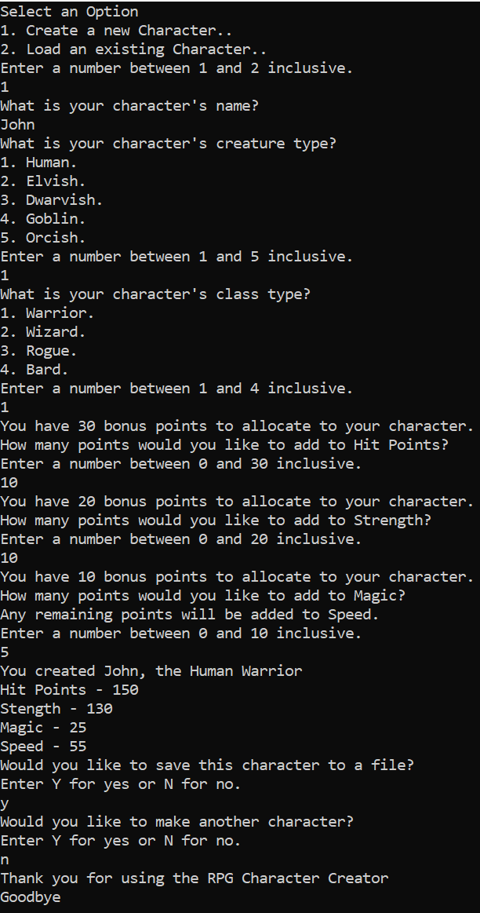

# Summative 5

## Challenge Description

Refactoring of given code to produce a Character Creator Program

## Code Listing

```cs
Console.WriteLine("Welcome to the RPG Character Creator");

//Methods
// TODO 1. Write a method to get a number in a range
// TODO 2. Use the get a number in range method wherever appropriate
// TODO 5. In the method to get a number in a range add exception handling to avoid FormatException (use try-catch rather than TryParse)

int GetNumberInRange(int lowerBound, int upperBound, string[] prompts = null)
{
    if (prompts != null)
    {
        foreach (string prompt in prompts)
        {
            Console.WriteLine(prompt);
        }
    }

    Console.WriteLine($"Enter a number between {lowerBound} and {upperBound} inclusive.");
    try
    {
        int number = int.Parse(Console.ReadLine());

        if (number >= lowerBound && number <= upperBound)
        {
            return number;
        }

        else
        {
            Console.WriteLine("Number out of bounds");
            return GetNumberInRange(lowerBound, upperBound);
        }
    }
    catch (FormatException)
    {
        Console.WriteLine("Invalid Input");
        return GetNumberInRange(lowerBound, upperBound);
    }

}

// TODO 3. Write a method to get a selection from a menu (hint, this method could call the number in a range method)
// TODO 4. Use the get a selection from a menu method wherever appropriate

int GetSelectionFromMenu(string question, string[] options)
{
    Console.WriteLine(question);
    for (int i = 1; i <= options.Length; i++)
    {
        Console.WriteLine($"{i}. {options[i - 1]}.");
    }

    return GetNumberInRange(1, options.Length);
}

// TODO 6. Add a method to get a yes or no value from the user
// TODO 7. Use the get a yes or no value from the user wherever appropriate
char GetYesorNo()
{
    Console.WriteLine("Enter Y for yes or N for no.");
    try
    {
        char value = char.Parse(Console.ReadLine().ToUpper());

        if (value == 'Y')
        {
            return value;
        }

        else if (value == 'N')
        {
            return value;
        }

        else
        {
            return GetYesorNo();
        }
    }
    catch (FormatException)
    {
        return GetYesorNo();
    }
}

char input;
do
{
    // TODO 3. Write a method to get a selection from a menu (hint, this method could call the number in a range method)

    int selection = GetSelectionFromMenu("Select an Option", new string[] { "Create a new Character.", "Load an existing Character." });


    string Name = string.Empty;
    string CreatureType = string.Empty;
    string CharacterClass = string.Empty;
    int HitPoints = 20;
    int Strength = 20;
    int Magic = 10;
    int Speed = 20;

    if (selection == 1) // manual character creation
    {
        Console.WriteLine("What is your character's name?");
        Name = Console.ReadLine();

        selection = GetSelectionFromMenu("What is your character's creature type?", new string[] { "Human", "Elvish", "Dwarvish", "Goblin", "Orcish" });


        if (selection == 1) // Human
        {
            CreatureType = "Human";
            HitPoints += 70;
            Strength += 50;
            Magic += 10;
            Speed += 30;
        }
        else if (selection == 2) // Elf
        {
            CreatureType = "Elvish";
            HitPoints += 50;
            Strength += 30;
            Magic += 40;
            Speed += 50;
        }
        else if (selection == 3) // Dwarf
        {
            CreatureType = "Dwarvish";
            HitPoints += 100;
            Strength += 80;
            Magic += 10;
            Speed += 10;
        }
        else if (selection == 4) // Goblin
        {
            CreatureType = "Goblin";
            HitPoints += 10;
            Strength += 10;
            Magic += 10;
            Speed += 40;
        }
        else if (selection == 5) // Orc
        {
            CreatureType = "Orcish";
            HitPoints += 120;
            Strength += 100;
            Speed += 20;
        }

        // TODO 4. Use the get a selection from a menu method wherever appropriate

        selection = GetSelectionFromMenu("What is your character's class type?", new string[] { "Warrior", "Wizard", "Rogue", "Bard" });

        if (selection == 1) // Warrior
        {
            CharacterClass = "Warrior";
            Strength += 50;
            HitPoints += 50;
        }
        else if (selection == 2) // Wizard
        {
            CharacterClass = "Wizard";
            Magic += 100;
        }
        else if (selection == 3) // Rogue
        {
            CharacterClass = "Rogue";
            HitPoints += 20;
            Magic += 30;
            Speed += 50;
        }
        else if (selection == 4) // Bard
        {
            CharacterClass = "Bard";
            HitPoints += 20;
            Magic += 50;
            Speed += 30;
        }

        int bonusPointsRemaining = 30;
        int bonusPointsToAdd = -1;
        // TODO 1. Write a method to get a number in a range

        bonusPointsToAdd = GetNumberInRange(0, bonusPointsRemaining, new string[] { $"You have {bonusPointsRemaining} bonus points to allocate to your character.", "How many points would you like to add to Hit Points?"});

        HitPoints += bonusPointsToAdd;
        bonusPointsRemaining -= bonusPointsToAdd;


        if (bonusPointsRemaining > 0)
        {
            // TODO 2. Use the get a number in range method wherever appropriate
            bonusPointsToAdd = GetNumberInRange(0, bonusPointsRemaining, new string[] { $"You have {bonusPointsRemaining} bonus points to allocate to your character." , "How many points would you like to add to Strength?"});

            Strength += bonusPointsToAdd;
            bonusPointsRemaining -= bonusPointsToAdd;
        }

        if (bonusPointsRemaining > 0)
        {

            bonusPointsToAdd = GetNumberInRange(0, bonusPointsRemaining, new string[] { $"You have {bonusPointsRemaining} bonus points to allocate to your character." , "How many points would you like to add to Magic?" , "Any remaining points will be added to Speed." });

            Magic += bonusPointsToAdd;
            bonusPointsRemaining -= bonusPointsToAdd;
            Speed += bonusPointsRemaining;
        }
    }
    else if (selection == 2) // load character from file
    {
        string[] files = Directory.GetFiles(Directory.GetCurrentDirectory(), "*.character");

        if (files.Length == 0)
        {
            Console.WriteLine("There are no character files to load.");
        }
        else
        {
            do
            {
                Console.WriteLine("Select an option:");
                for (int i = 0; i < files.Length; i++)
                {
                    Console.WriteLine($"{i + 1}. {files[i].Substring(files[i].LastIndexOf('\\') + 1)}");
                }
                selection = int.Parse(Console.ReadLine()) - 1;
            } while (selection < 0 && selection > files.Length - 1);

            /* Format is
			Name - name
			Type - creature type
			Class - character class
			Stats - HitPoints Strength Magic Speed
			*/
            string[] lines = File.ReadAllLines(files[selection]);
            Name = lines[0].Substring(lines[0].LastIndexOf(' ') + 1);
            CreatureType = lines[1].Substring(lines[1].LastIndexOf(' ') + 1);
            CharacterClass = lines[2].Substring(lines[2].LastIndexOf(' ') + 1);
            lines = lines[3].Split(' ');
            HitPoints = int.Parse(lines[2]);
            Strength = int.Parse(lines[3]);
            Magic = int.Parse(lines[4]);
            Speed = int.Parse(lines[5]);
        }
    }

    Console.WriteLine($"You created {Name}, the {CreatureType} {CharacterClass}");
    Console.WriteLine($"Hit Points - {HitPoints}");
    Console.WriteLine($"Stength - {Strength}");
    Console.WriteLine($"Magic - {Magic}");
    Console.WriteLine($"Speed - {Speed}");

    // TODO 6. Add a method to get a yes or no value from the user

    Console.WriteLine("Would you like to save this character to a file?");
    input = GetYesorNo();

    if (input == 'Y')
    {
        StreamWriter writer = new StreamWriter($"{Name}_the_{CreatureType}_{CharacterClass}.character");
        writer.WriteLine($"Name - {Name}");
        writer.WriteLine($"Type - {CreatureType}");
        writer.WriteLine($"Class - {CharacterClass}");
        writer.WriteLine($"Stats - {HitPoints} {Strength} {Magic} {Speed}");
        writer.Close();
    }

    // TODO 7. Use the get a yes or no value from the user wherever appropriate

    Console.WriteLine("Would you like to make another character?");
    input = GetYesorNo();


} while (input == 'Y');

Console.WriteLine("Thank you for using the RPG Character Creator");
Console.WriteLine("Goodbye");
```

## Evidence



## Feedback Request

If there is anything specific you want to ask for feedback on include that here
