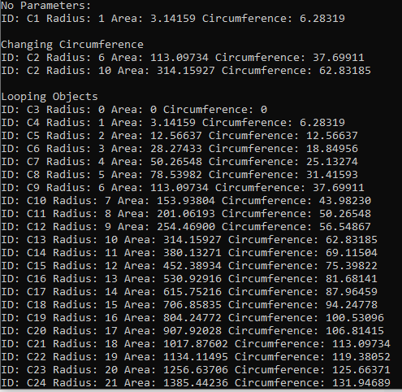

# Summative 6

## Challenge Description
Creating Objects from a circle class whereby a radius measurement is given and the program instantiates an object with methods for calculating circumference and area of a circle based on that radius.
## Code Listing - Main Code

```cs
using Summative_6;


bool running = true;

do
{
    Console.WriteLine("Enter 1 for Demonstration, Enter 2 for GUI Interface, Enter 3 to quit");
    int setupInput = int.Parse(Console.ReadLine());

    //Demonstration
    if (setupInput == 1)
    {
        Console.WriteLine("No Parameters:");
        Circle Circle1 = new Circle();
        Console.WriteLine("ID: " + Circle1.GetID() + " Radius: " + Circle1.GetRadius() + " Area: " + Circle1.CalculateArea() + " Circumference: " + Circle1.CalculateCircumference());
        Console.WriteLine();


        Console.WriteLine("Changing Circumference");

        Circle Circle2 = new Circle(6);
        Console.WriteLine("ID: " + Circle2.GetID() + " Radius: " + Circle2.GetRadius() + " Area: " + Circle2.CalculateArea() + " Circumference: " + Circle2.CalculateCircumference());
        Circle2.SetRadius(10);
        Console.WriteLine("ID: " + Circle2.GetID() + " Radius: " + Circle2.GetRadius() + " Area: " + Circle2.CalculateArea() + " Circumference: " + Circle2.CalculateCircumference());


        Console.WriteLine();
        Console.WriteLine("Looping Objects");

        Circle[] circles = new Circle[30];
        for (int i = 0; i < 25; i++)
        {
            Circle circle = new Circle(i);
            circles[i] = circle;
            Console.WriteLine("ID: " + circle.GetID() + " Radius: " + circle.GetRadius() + " Area: " + circle.CalculateArea() + " Circumference: " + circle.CalculateCircumference());
        }
        Console.WriteLine();


    }

    //GUI Example
    else if (setupInput == 2)
    {
        Console.Clear();
        bool guiRunning = true;

        do
        {
            Console.WriteLine("Welcome to the Circle Calculator");
            Console.WriteLine();
            Console.WriteLine("Enter 1 to Create a Circle, Enter 2 to Edit a circle, Enter 3 to View all Circles, Enter 4 to Clear the Console, Enter 5 to Exit");
            int choice;

            if (int.TryParse(Console.ReadLine(), out choice))
            {
                if (choice == 1)
                {
                    Console.WriteLine("Please enter a radius");
                    int radius;
                    if (int.TryParse(Console.ReadLine(), out radius))
                    {
                        if (radius >= 0)
                        {
                            Circle currentCircle = new Circle(radius);
                            Console.WriteLine("New Circle Created:");
                            Console.WriteLine("ID: " + currentCircle.GetID() + " Radius: " + currentCircle.GetRadius() + " Area: " + currentCircle.CalculateArea() + " Circumference: " + currentCircle.CalculateCircumference());

                        }

                        else
                        {
                            Console.WriteLine("Invalid Input");
                        }

                    }

                    else
                    {
                        Console.WriteLine("Invalid Input");
                    }

                        

                }

                else if (choice == 2)
                {
                    Console.WriteLine("Please Enter a Circle ID");
                    string circleID = Console.ReadLine();
                    bool found = false;
                    foreach (Circle obj in Circle.circles)
                    {
                        if (obj.GetID() == circleID)
                        {
                            found = true;
                            Console.WriteLine("Current Circle Radius: " + obj.GetRadius() + " Area: " + obj.CalculateArea() + " Circumference: " + obj.CalculateCircumference());
                            Console.WriteLine();
                            int newRadius;
                            Console.WriteLine("Enter a new radius:");

                            if (int.TryParse(Console.ReadLine(), out newRadius))
                            {
                                if (newRadius >= 0)
                                {
                                    obj.SetRadius(newRadius);
                                    Console.WriteLine("New Circle Radius: " + obj.GetRadius() + " Area: " + obj.CalculateArea() + " Circumference: " + obj.CalculateCircumference());

                                }

                                else
                                {
                                    Console.WriteLine("Invalid Input");
                                }

                            }

                            else
                            {
                                Console.WriteLine("Invalid Input");
                            }
                        }
                    }

                    if (found == false)
                    {
                        Console.WriteLine("That CircleID does not exist");
                    }

                }

                else if (choice == 3)
                {
                    foreach (Circle obj in Circle.circles)
                    {
                        Console.WriteLine("ID: " + obj.GetID() + " Radius: " + obj.GetRadius() + " Area: " + obj.CalculateArea() + " Circumference: " + obj.CalculateCircumference());

                    }
                }

                else if (choice == 4)
                {
                    Console.Clear();
                }

                else if (choice == 5)
                {
                    guiRunning = false;
                }

                else
                {
                    Console.WriteLine("Invalid Input");
                }

            }


            else
            {
                Console.WriteLine("Invalid Input");
            }
            


        }while (guiRunning);

    }


    //Exit
    else if (setupInput == 3)
    {
        running = false;
    }

    else
    {
        Console.WriteLine("Invalid Input");
    }


} while (running);


```
## Code Listing - Circle Class
```cs
using System;
using System.Collections.Generic;
using System.Linq;
using System.Runtime.CompilerServices;
using System.Text;
using System.Threading.Tasks;

namespace Summative_6
{
    internal class Circle
    {
        //Variables
        private int radius;
        private static int IDCount = 1;        //Keeps track of last ID
        public static List<Circle> circles = new List<Circle>();
        private string ID;

        //Constructors

        public Circle()
        {
            this.radius = 1;
            this.ID  = "C" + IDCount++;        //Assign Unique ID and increment last ID
        }

        public Circle(int radius)
        {
            if (radius < 0)
            {
                throw new Exception("Radius cannot be below zero");
            }

            else
            {
                this.radius = radius;
            }

            this.ID = "C" + IDCount++;

            circles.Add(this);

        }


        //Getters
        public int GetRadius()
        {
            return this.radius;
        }

        public string GetID()
        {
            return this.ID;
        }

        //Setter
        public void SetRadius(int radius)
        {
            this.radius = radius;
        }

        //Calculations
        public decimal CalculateArea()
        {
            decimal Area = ((decimal)Math.PI * (this.radius*this.radius));
            Area = Math.Round(Area,5);
            return Area;
        }

        public decimal CalculateCircumference()
        {
            decimal Circumference = 2 * (decimal)Math.PI * this.radius;
            Circumference = Math.Round(Circumference, 5);
            return Circumference;
        }


        

    }
}
```


## Results


## Feedback Request

If there is anything specific you want to ask for feedback on include that here
