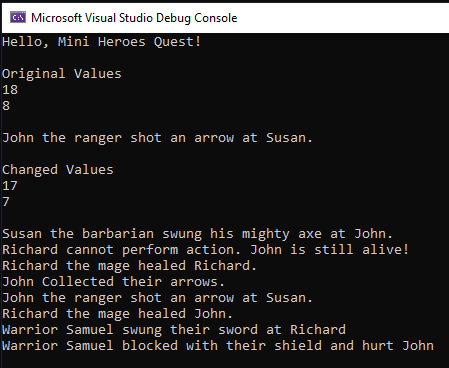

# Summative 7

## Challenge Description

Refactoring of given code to showcase encapsulation and inheritance via a class based game.

## Code Listing - Program.cs

```cs
using Summative_7;


Console.WriteLine("Hello, Mini Heroes Quest!");
Console.WriteLine();


// Here we create some instances of characters
Ranger ranger = new Ranger("John");
Barbarian barbarian = new Barbarian("Susan");
Mage mage = new Mage("Richard");
Warrior warrior = new Warrior("Samuel");


// This is how this should be used
Console.WriteLine("Original Values");
Console.WriteLine($"{barbarian.HealthPoints}");
Console.WriteLine(ranger.EnergyPoints);
Console.WriteLine();

ranger.FireArrows(barbarian);
Console.WriteLine();

Console.WriteLine("Changed Values");
Console.WriteLine($"{barbarian.HealthPoints}");
Console.WriteLine(ranger.EnergyPoints);
Console.WriteLine();

barbarian.SwingAxe(ranger);
mage.Resurrect(ranger);
mage.Heal(mage);
ranger.CollectArrows();
ranger.FireArrows(barbarian);
mage.Heal(ranger);

warrior.SwingSword(mage);
warrior.ShieldBlock(ranger);


/*
// This is undesirable behaviour that we want to stop happening
barbarian.FireArrows(mage);
mage.SwingAxe(barbarian);
mage.ChangeCharacterHealth(mage,20000);
*/


```

## Code Listing - Parent Character Class 

```cs
using System;
using System.Collections.Generic;
using System.Linq;
using System.Text;
using System.Threading.Tasks;


namespace Summative_7
{
    /// <summary>
    /// Character Parent Class for creation of Characters in game
    /// </summary>
    public class Character
    {
        /// <summary>
        /// Represents Character instance int energy points to alter instance HealthPoints
        /// </summary>
        private int _energyPoints;

        /// <summary>
        /// Represents private member Character instance health points to alter instance EnergyPoints
        /// </summary>
        private int _healthPoints;

        /// <summary>
        /// Represents the maximium int health points of the Character Class
        /// </summary>
        public int MaxHealthPoints { get; protected set; }

        /// <summary>
        /// Represents the maximium int Energy points of the Character Class
        /// </summary>
        public int MaxEnergyPoints { get; protected set; }

        /// <summary>
        /// Represents the string name of the Character
        /// </summary>
        public string Name { get; private set; }

        /// <summary>
        /// Represents the current int health points of the Character
        /// </summary>
        public int HealthPoints { get { return _healthPoints; } private set { } }

        /// <summary>
        /// Represents the current int energy points of the Character
        /// </summary>
        public int EnergyPoints { get { return _energyPoints; } private set { } }

        /// <summary>
        /// Represents the current bool Knocked out status of the Character
        /// </summary>
        public bool isKnockedOut { get { return HealthPoints <= 0; } private set { } }


        


        /// <summary>
        /// Represents the Constructor Class of the Character
        /// </summary>
        /// <param name="name">The desired name of the character</param>
        public Character(string name)
        {
            Name = name;
        }

        /// <summary>
        /// Method to allow manipulation of Character Instance Health points
        /// </summary>
        /// <param name="target">The target Character Instance</param>
        /// <param name="adjustment">The intended adjustment int value e.g. -4,30</param>
        protected void ChangeCharacterHealth(Character target, int adjustment)
        {
            int value = target.HealthPoints;
            value = value + adjustment;
            if (value < target.MaxHealthPoints) { target._healthPoints = value; }
            else { target._healthPoints = target.MaxHealthPoints; }
        }

        /// <summary>
        /// Method to allow manipulation of Character Instance Health points
        /// </summary>
        /// <param name="target">The target Character Instance</param>
        /// <param name="adjustment">The intended adjustment int value e.g. -4,30</param>
        protected void ChangeCharacterEnergy(Character target, int adjustment)
        {
            int value = target.EnergyPoints;
            value = value + adjustment;
            if (value < target.MaxEnergyPoints) { target._energyPoints = value; }
            else { target._energyPoints = target.MaxEnergyPoints; }
        }

        /// <summary>
        /// Method to allow manipulation of Character Instance Knock out Status
        /// </summary>
        /// <param name="target">The target Character Instance</param>
        /// <param name="status">The intended boolean value e.g. true, false</param>
        protected void ChangeKnockoutStatus(Character target, bool status)
        {
            target.isKnockedOut = status;
        }

        /// <summary>
        /// Method to implement Resting for Character. Replenishes energy and health.
        /// </summary>
        public void Rest()
        {
            if (!isKnockedOut)
            {
                EnergyPoints = MaxEnergyPoints;
                HealthPoints = MaxHealthPoints;
            }
        }
    }
}

```

## Code Listing - Child Barbarian Class

```cs
using System;
using System.Collections.Generic;
using System.Linq;
using System.Text;
using System.Threading.Tasks;

namespace Summative_7
{
    /// <summary>
    /// Barbarian character class
    /// </summary>
    internal class Barbarian : Character
    {
        /// <summary>
        /// Instantiates Character variable for the instance
        /// </summary>
        private Character self;

        /// <summary>
        /// Constructor method to set default values for health and energy
        /// </summary>
        /// <param name="name">The desired name of the character</param>
        public Barbarian(string name) : base(name) 
        {
            MaxHealthPoints = 18;
            MaxEnergyPoints = 12;

            self = this;
            ChangeCharacterEnergy(self, MaxEnergyPoints);
            ChangeCharacterHealth(self, MaxHealthPoints);
            
        }

        /// <summary>
        /// Swing Axe move for Barbarian Class
        /// </summary>
        /// <param name="target">The intended Character Instance</param>
        public void SwingAxe(Character target) 
        {
            if (isKnockedOut)
            {
                Console.WriteLine($"{Name} cannot perform action, they were knocked out!");
            }

            else if (EnergyPoints >= 3)
            {
                Console.WriteLine($"{Name} the barbarian swung his mighty axe at {target.Name}.");
                ChangeCharacterEnergy(self,-3);
                ChangeCharacterHealth(target, -3);
            }

            else
            {
                Console.WriteLine($"{Name} the barbarian does not have enough energy.");
            }
        }
    }
}

```

## Code Listing - Child Ranger Class

```cs
using System;
using System.Collections.Generic;
using System.Linq;
using System.Text;
using System.Threading.Tasks;

namespace Summative_7
{
    /// <summary>
    /// Ranger Character class
    /// </summary>
    internal class Ranger : Character
    {
        /// <summary>
        /// Instantiates Character variable for the instance
        /// </summary>
        private Character self;
        /// <summary>
        /// Integer variable for the amount of arrows the Ranger Class initially carries.
        /// </summary>
        public int NumberOfArrows { get; private set; }
        /// <summary>
        /// Integer variable for the amount of arrows the Ranger Class has currently fired.
        /// </summary>
        public int FiredArrows { get; private set; }

        /// <summary>
        /// Constructor method to set default values for health and energy
        /// </summary>
        /// <param name="name">The desired name of the character</param>
        public Ranger(string name) : base(name)
        {
            MaxHealthPoints = 10;
            MaxEnergyPoints = 8;

            self = this;
            ChangeCharacterEnergy(self, MaxEnergyPoints);
            ChangeCharacterHealth(self, MaxHealthPoints);
            this.NumberOfArrows = 10;
        }

        /// <summary>
        /// Arrow collection method for Ranger class to Replenish arrows
        /// </summary>
        public void CollectArrows()
        {
            if (isKnockedOut)
            {
                Console.WriteLine($"{Name} cannot perform action, they were knocked out!");
                return;
            }
            else
            {
                Console.WriteLine($"{Name} Collected their arrows.");
                NumberOfArrows += FiredArrows;
                FiredArrows = 0;
            }
            
            
        }

        /// <summary>
        /// Fire Arrow Method for Ranger Class to attack other Character Class
        /// </summary>
        /// <param name="target">The intended Character Instance</param>
        public void FireArrows(Character target)
        {
            if (isKnockedOut)
            {
                Console.WriteLine($"{Name} cannot perform action, they were knocked out!");
                return;
            }

            else if (NumberOfArrows > 0)
            {
                if (EnergyPoints >= 1)
                {
                    ChangeCharacterEnergy(self, -1);
                    NumberOfArrows--;
                    FiredArrows++;
                    Console.WriteLine($"{Name} the ranger shot an arrow at {target.Name}.");
                    ChangeCharacterHealth(target,-1);
                }

                else
                {
                    Console.WriteLine($"{Name} the ranger does not have enough energy.");
                }

            }

            else
            {
                Console.WriteLine($"{Name} the ranger does not have enough arrows.");
            }

            
        }
    }
}

```

## Code Listing - Child Mage Class

```cs
using System;
using System.Collections.Generic;
using System.Linq;
using System.Text;
using System.Threading.Tasks;

namespace Summative_7
{
    /// <summary>
    /// Mage Character class
    /// </summary>
    internal class Mage : Character
    {
        /// <summary>
        /// Instantiates Character variable for the instance
        /// </summary>
        private Character self;

        /// <summary>
        /// Constructor method to set default values for health and energy
        /// </summary>
        /// <param name="name">The desired name of the character</param>
        public Mage(string name) : base(name)
        {
            MaxHealthPoints = 8;
            MaxEnergyPoints = 8;

            self = this;
            ChangeCharacterEnergy(self, MaxEnergyPoints);
            ChangeCharacterHealth(self, MaxHealthPoints);

        }

        /// <summary>
        /// Throw Fireball method for Mage class to Attack other Character Instances
        /// </summary>
        /// <param name="target">The intended Character Instance</param>
        public void ThrowFireball(Character target)
        {
            if (isKnockedOut)
            {
                Console.WriteLine($"{Name} cannot perform action, they were knocked out!");
            }
            
            else if (EnergyPoints >= 2)
            {
                Console.WriteLine($"{Name} the mage threw a fireball at {target.Name}.");
                ChangeCharacterHealth(target, -2);
                ChangeCharacterEnergy(self, -2);
            }

            else
            {
                Console.WriteLine($"{Name} the mage does not have enough energy.");
            }
            
        }

        /// <summary>
        /// Heal method for Mage class to heal a Character Instance
        /// </summary>
        /// <param name="target">The intended Character Instance</param>
        public void Heal(Character target)
        {
            if (isKnockedOut)
            {
                Console.WriteLine($"{Name} cannot perform action, they were knocked out!");
            }

            else if (EnergyPoints >= 1)
            {
                ChangeCharacterEnergy(self,-1);
                ChangeCharacterHealth(target,5);
                Console.WriteLine($"{Name} the mage healed {target.Name}.");
            }
            else
            {
                Console.WriteLine($"{Name} the mage does not have enough energy.");
            }
        }

        /// <summary>
        /// Resurrect method for the Mage class to change status of isKnocked variable on Character Classes
        /// </summary>
        /// <param name="target">The intended Character Instance</param>
        public void Resurrect(Character target)
        {
            if (isKnockedOut)
            {
                Console.WriteLine($"{Name} cannot perform action, they were knocked out!");
            }

            else if (!target.isKnockedOut)
            {
                Console.WriteLine($"{Name} cannot perform action. {target.Name} is still alive!");
            }

            else if (EnergyPoints >= 5)
            {
                ChangeCharacterEnergy(self,-5);
                ChangeKnockoutStatus(target,false); 
                ChangeCharacterEnergy(target, target.MaxEnergyPoints);
                Console.WriteLine($"{Name} the mage resurrected {target.Name}.");
            }

            else
            {
                Console.WriteLine($"{Name} the mage does not have enough energy.");
            }
        }
    }
}

```

## Code Listing - Child Warrior Class

```cs
using System;
using System.Collections.Generic;
using System.Linq;
using System.Text;
using System.Threading.Tasks;

namespace Summative_7
{
    /// <summary>
    /// Warrior character class
    /// </summary>
    internal class Warrior : Character
    {
        /// <summary>
        /// Instantiates Character variable for the instance
        /// </summary>
        private Character self;

        /// <summary>
        /// Constructor method to set default values for health and energy
        /// </summary>
        /// <param name="name">The desired name of the character</param>
        public Warrior(string name) : base(name)
        {
            MaxHealthPoints = 15;
            MaxEnergyPoints = 10;

            self = this;
            ChangeCharacterEnergy(self, MaxEnergyPoints);
            ChangeCharacterHealth(self, MaxHealthPoints);

        }

        /// <summary>
        /// SwingSword method for Warrior class to attack Character Instance
        /// </summary>
        /// <param name="target">The intended Character Instance</param>
        public void SwingSword (Character target)
        {
            ChangeCharacterHealth(target, (target.HealthPoints/2)*-1);
            ChangeCharacterEnergy(self, -5);

            Console.WriteLine($"Warrior {Name} swung their sword at {target.Name}");
        }

        /// <summary>
        /// ShieldBlock method for Warrior class to heal self and deal damage to intended Character Instance
        /// </summary>
        /// <param name="target">The intended Character Instance</param>
        public void ShieldBlock(Character target)
        {
            ChangeCharacterHealth(self, 3);
            ChangeCharacterHealth(target, -2);
            ChangeCharacterEnergy(self, -2);

            Console.WriteLine($"Warrior {Name} blocked with their shield and hurt {target.Name}");
        }
    }
}

```

## Results



## Feedback Request

If there is anything specific you want to ask for feedback on include that here
